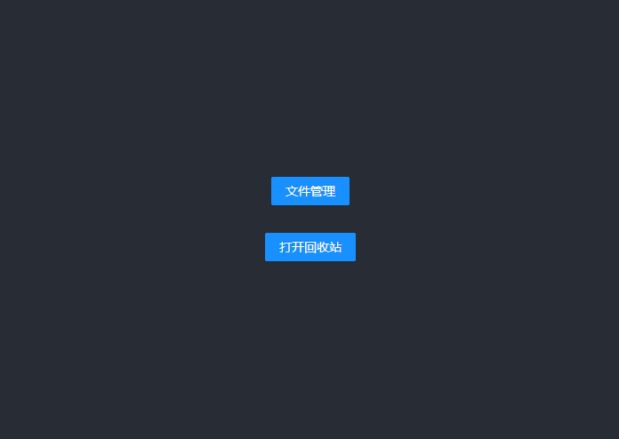
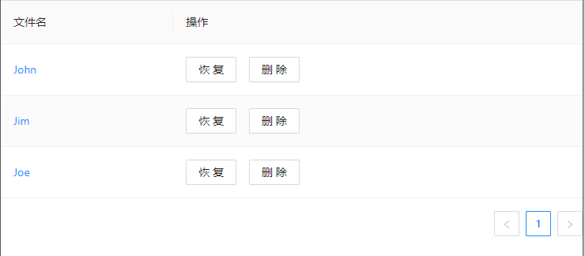
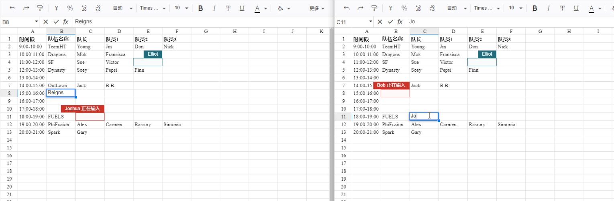
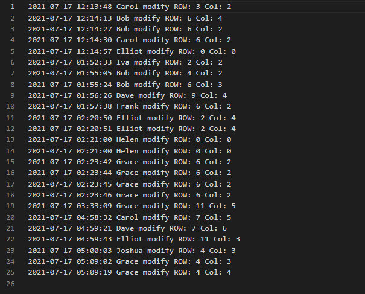
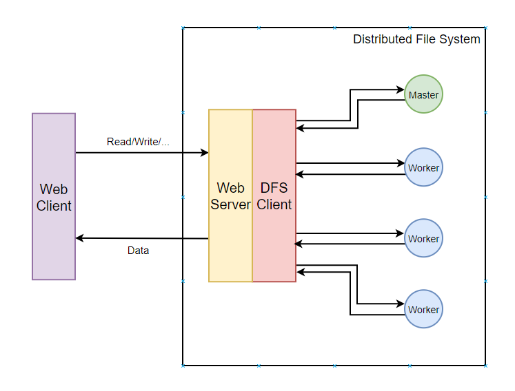
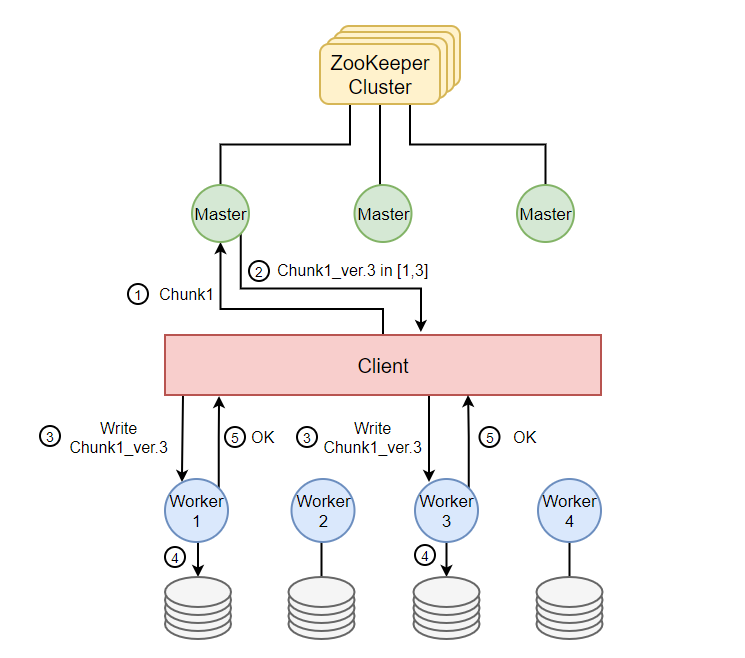
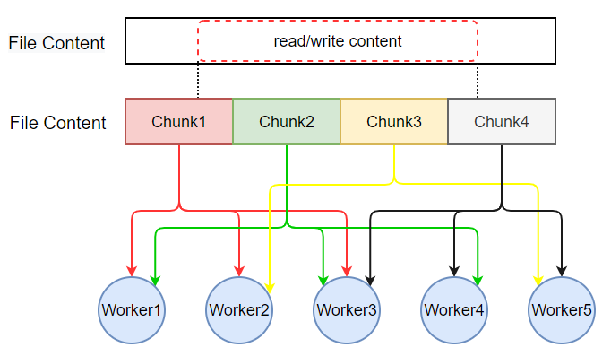
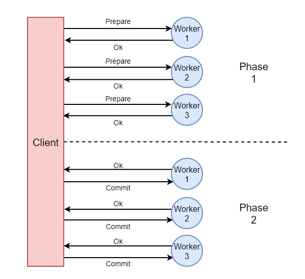
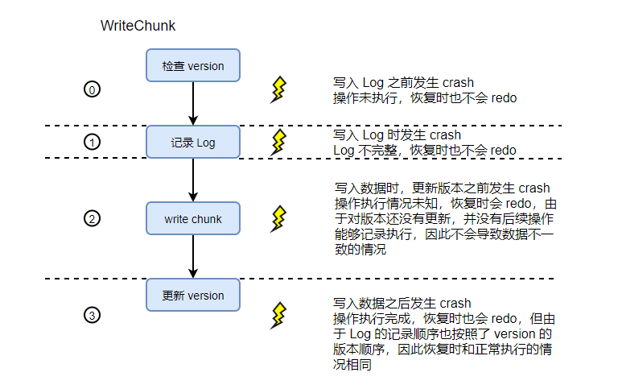
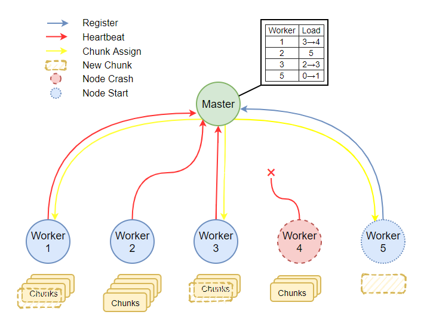

# Naïve gDocs

### PART 1: Naïve gDocs

##### Ⅰ. Overview

Naïve gDocs 项目是一款多人在线表格编辑工具。项目为用户提供了表格管理，在线合作编辑，文件回收站等功能。gDocs 的整体架构分为用户 UI 界面（Web 前端）以及 HTTP Server（Web后端），并使用分布式文件系统（DFS）来提供数据持久化的服务。

用户通过与 Web 前端页面交互来使用 Naïve gDocs 系统。Web 前端通过 HTTP 以及 WebSocket 协议与 HTTP Server 进行数据交互，HTTP Server 在处理请求的过程中，通过调用 DFS Client 提供的的接口，与 DFS 进行数据交互。

Web 前端使用 JavaScript 实现，使用了 React 框架以及开源表格组件 Luckysheet。Web 后端使用 Go 语言实现。

##### Ⅱ. Web前端

Web 前端包括三个主要的页面，分别为**主页**、**回收站列表**和**表格页面**。

主页用于文件的创建、搜索、删除与管理；回收站列表用于管理已删除的文件，提供彻底删除和恢复；表格页面用于展示表格文件的具体内容。具体页面布局如下图 1，图 2，图 3 所示：



<center>图 1：主页</center>



<center>图 2：回收站页</center>


<center>图 3：表格页</center>

由于本项目的重点是后端的 DFS，而前端主要的目的是提供一个基于后端 DFS 的可共同编辑的文档，因此前端的界面实现较为简洁，但功能都满足了要求。主页和回收站列表布局与交互使用了 Ant design 提供的组件，表格页面则使用了开源表格组件 LuckySheet 来实现表格的布局与操作。LuckySheet 提供了丰富的表格功能，且定义了数据交互以及协同编辑的接口。通过以规定的数据格式与 Web 后端进行数据交互，实现了表格的创建，协同修改，存储等功能，除基础功能外我们还借助 LuckySheet 提供的接口实现了图片的存储显示和多用户共享。另外还提供了文件操作的简单的 Log 记录。

##### Ⅲ. Web后端

HTTP Server 一方面监听前端的 HTTP 与 WebSocket 请求，另一方面作为 DFS 的 Client，调用文件系统的接口来进行数据持久化。

下面介绍 HTTP Server 实现的各种 HTTP handler 函数，当 HTTP Server 接收到特定的请求之后，会调用对应的 Handler 处理请求，并返回给前端。

+ *isFileAlive*

  ```go
  func isFileAlive(writer http.ResponseWriter, request *http.Request)
  ```

  用于判断文件是否存在。根据前端发来的 HTTP 请求，得到参数 `filename`，调用DFS的 `Open` 接口得到文件描述符 `fd` 和错误信息 `err`，若 `err` 不为空则返回给前端此文件不存在，否则返回文件存在。

+ *create*

  ```go
  func create(writer http.ResponseWriter, request *http.Request) 
  ```

  用于创建新文件。根据前端发来的 HTTP 请求，得到参数 `filename`，调用 DFS 的 `Create` 接口创建对应文件得到文件描述符 `fd` 和错误信息 `err` ，若 `err` 为空则返回给前端创建文件成功，否则返回失败。同时，此接口还会在 `/Log` 目录下，调用 DFS 的 `Create` 接口创建对应的日志文件用于记录日志，得到文件描述符 `fd` 和错误信息 `err`，若 `err` 为空则返回给前端创建文件日志成功，否则返回失败。

+ *load*

  ```go
  func load(writer http.ResponseWriter, request *http.Request)
  ```

  用于为前端提供初始化表格的数据。根据前端发来的 HTTP 请求，得到参数 `filename`，调用 DFS 的 `Open` 接口得到文件描述符 `fd` ，再调用 `Read` 接口读取文件的内容，通过 `Split` 函数将文件内容划分为一个 String 的数组，遍历数组得到表格数据 `celldataList` 和图片数据 `imageList` 。最后，添加 `data` 中的其他参数内容，将 `data` 转换成 JSON 格式，发送给前端。若出现异常，则返回失败。

+ *getRecycleBin*

  ```go
  func getRecycleBin(writer http.ResponseWriter, request *http.Request)
  ```

  用于获取回收站列表。调用 DFS 的 `Open` 接口得到 `/RecycleBin` 的文件描述符 `fd` ，再调用 `Read` 接口读出该文件的内容，通过 `Split` 函数将文件内容划分为一个 String 的数组，遍历数组得到 `datalist` 。最后将其转成 JSON 格式发送给前端。若出现异常，则返回失败。

+ *falseDelete*

  ```go
  func falseDelete(writer http.ResponseWriter, request *http.Request) 
  ```

  用于删除文件。根据前端发来的请求，得到参数 `filename` ，调用 DFS 的 `Append` 接口在 `/RecycleBin` 文件中加入该 `filename` ，调用 `Read` 接口读出该文件的内容并保存在 `data` 中，调用 `Delete` 接口在 DFS 中删除该文件。最后在 `/copy` 目录下新建一个同名文件，写入 `data`，并返回给前端删除成功。但此时文件并未彻底删除，仍可以从回收站中恢复。

+ *trueDelete*

  ```go
  func trueDelete(writer http.ResponseWriter, request *http.Request)
  ```

  用于删除回收站文件。根据前端发来的请求，得到参数 `filename` ，调用 DFS 的 `Read` 接口读出 `/RecycleBin`的内容并保存在 `data` 中，通过 `Split`函数将 `data` 划分为一个 String 的数组，遍历数组删除对应的文件的文件名。最后删除在 `/copy` 目录下的同名文件，并返回给前端删除成功。此时文件彻底删除。

+ *restore*

  ```go
  func restore(writer http.ResponseWriter, request *http.Request)
  ```

  用于恢复回收站文件。根据前端发来的请求，得到参数 `filename` ，调用 DFS 的 `Read` 接口读出 `/RecycleBin` 的内容并保存在 data 中，通过 `Split` 函数将 `data` 划分为一个 String 的数组，遍历数组删除对应的文件的文件名。最后创建一个新的文件保存 `/copy` 目录下的同名文件的内容，删除 `/copy` 目录下的该文件，并返回给前端恢复成功。

##### Ⅳ. 前后端以及DFS的数据交互

LuckySheet 组件本身定义了 `loadUrl` 和 `updateUrl` 接口，分别用于首次加载时的初始化和数据同步更新。

###### loadUrl

`loadurl` 为 HTTP 请求，在表格初始化时调用。通过后端返回的约定的工作表数据来渲染表格页面。

Naïve gDocs 的工作表数据结构如下所示：

```
[	
	{
		"name": "Cell",
		"index": "sheet_01",
		"order":  0,
		"status": 1,
		"celldata": [],
		"images": []
	}
]
```

在表格初始化时，Naïve gDocs 根据如上结构的数据，来渲染出文件系统中存储的表格数据。

`celldata` 项用于存储每一个单元格内的数据项，其中每一个数据项均为一个 JSON 对象，关键的基本结构如下：

```
{
    "r":0,       //行号
    "c":0,       //列号
    "v"：{
        "ct": { //单元格值格式
           "fa": "General",  //格式名称
           "t": "n" //格式类型
        },
        "v": 233, //内容的原始值
        "m": 233, //内容的显示值
    }
}
```

`images` 项用于存储表格中的图片数据，其中每一个数据项均为一个 JSON 对象，基本结构如下：

```
{
    type: '3',  //1移动并调整单元格大小 2移动并且不调整单元格的大小 3不要移动单元格并调整其大小
    src: '',  //图片url
    originWidth: 1484,  //图片原始宽度
    originHeight: 834,  //图片原始高度
    default: {
        width: 293,  //图片 宽度
        height: 196,  //图片 高度
        left: 409,  //图片离表格左边的 位置
        top: 248,  //图片离表格顶部的 位置
    },
    crop: {
        width: 293,  //图片裁剪后 宽度
        height: 196,  //图片裁剪后 高度
        offsetLeft: 0,  //图片裁剪后离未裁剪时 左边的位移
        offsetTop: 0,  //图片裁剪后离未裁剪时 顶部的位移
    },
    isFixedPos: false,  //固定位置
    fixedLeft: 507,  //固定位置 左位移
    fixedTop: 141,  //固定位置 右位移
    border: {
        width: 0,  //边框宽度
        radius: 0,  //边框半径
        style: 'solid',  //边框类型
        color: '#000',  //边框颜色
    }
}
```

在 Naïve gDocs 的实现中，所有单元格以及图片数据均按照如上定义的结构进行存储与传输。在进行数据持久化时，每一个表格内的数据以字符串的形式存储在 DFS 中的一个与表格同名的文件中，并且以分隔符将每一个数据项分开。当收到 `loadUrl` 请求时，后端会从文件系统中寻找对应的文件，并依次读取出文件中的每一个数据对象，判断数据类型后，分别存储在 `celldata` 和 `images` 项中，然后将整个工作表数据封装为 JSON 格式返回给前端。前端的组件则会根据收到的数据渲染页面。

###### updateUrl

`updateUrl` 为 WebSocket 请求，用于多个 Web 之间数据的协同更新。

当用户对表格中的数据或图片进行了编辑，或者执行移动光标等操作时，会通过 `updateUrl` ，向后台发送操作数据。操作类型主要分为三类：光标移动点击、图片编辑、单元格编辑。三种操作数据的基本结构如下：

```
//编辑单元格
{
    "t": "v",   //操作类型，v表示编辑单元格
    "v": {      //单元格内数据
        "v": 233,
        "ct": { "fa": "General", "t": "n" },
        "m": "233"
    },
    "r": 0,     //行号
    "c": 1      //列号
}
//移动光标
{
    "t": "mv",   //操作类型，mv表示光标移动
    "r": 0,     //行号
    "c": 1      //列号
}
//图片
{
    "t": "all"  //操作类型，all表示通用存储格式，此处仅用于存储图片
    data:{
    	...
    }     //图片数据
    k: "image"  //k为通用保存的key，此处仅使用图片
}
```

Web 后端在收到这些数据后，一方面会根据操作内容，通过调用 DFS 的接口对文件系统内的文件执行相应的修改；另一方面还会通过 WebSocket 将数据转发给连接着的打开了相同文件的其他客户端。

##### Ⅴ. 基于 WebSocket 的协同编辑

如前文提到的，`updateUrl` 使用 WebSocket 协议来实现协同编辑的功能。WebSocket 主要起到了多客户端之间的数据转发的作用。

区别于传统的 HTTP 协议，WebSocket 是一个持久化的协议，能够维持长连接，且能主动向客户端推送数据。

在 Naïve gDocs 中，后端定义了一种 `WsClient` 和 `ClientManager` 结构。

`WsClient` 结构如下

```go
type WsClient struct {
	username string          // 用户名
	filename string          // 文件名
	id       string          // 用户id
	socket   *websocket.Conn // 连接的socket
	send     chan []byte     // 发送的消息
}
```

该结构包含了 WebSocket 连接，用户信息以及一个信息发送通道 `send` 。

`ClientManager` 结构如下

```go
//客户端管理
type ClientManager struct {
	//客户端 map 储存并管理所有的长连接client，在线的为true，不在的为false
	clients map[*WsClient]bool
	//web端发送来的的message我们用broadcast来接收，并最后分发给所有的client
	broadcast chan []byte
	//谁发来的信息
	cid string
	//新创建的长连接client
	register chan *WsClient
	//新注销的长连接client
	unregister chan *WsClient
}
```

该结构记录了文件的名字以及连接该文件的全部 WebSocket 长连接，消息发起人，以及注册，注销和广播通道。

我们在后端指定了 WebSocket 的接口，后端在启动之后会进行持续监听。当有用户连接时，会调用如下的 handler：

```go
func wsHandler(res http.ResponseWriter, req *http.Request) 
```

该 Handler 首先将 HTTP 协议升级为 WebSocket 协议，然后查找对应文件的 `ClientManager` 是否存在，若不存在则用 goroutine 创建一个新的 `manager`，并将此连接和之后的同一文件的连接都交给该 `manager` 管理。同时 `WsClient` 也会用 goroutine 启动两个新协程，read 协程用于读取前端发送来的数据，write 协程用于向前端发送数据。

当一个客户端执行了操作后，会向后端发送其操作的数据，`WsClient` 的 read 协程读取到数据，一方面调用 DFS 接口对底层的文件系统进行文件内容的修改，另一方面，还会将数据发送给自己所属的 `manager` 的 `broadcast` 通道。`manager` 在读取到 `broadcast` 中的数据后，会将数据发送给连接着相同文件的其他 `WsClient` 的 `send` 通道。其他 `WsClient` 的 write 协程从自己 `send` 通道中读取到新的数据时，会将其返回给前端。前端根据收到的数据，对页面进行更新渲染。由此实现了多端数据同步。

借助 WebSocket，我们实现的协同编辑的界面如下图 4：



<center>图 4：多用户协同编辑</center>

##### Ⅵ. 回收站机制

Naïve gDocs 提供了回收站机制。用户可以从回收站中恢复自己删除的文件，也可以从回收站中彻底删除文件。

该机制的实现思路如下：文件系统中维护名为 `/RecycleBin` 文件，用来记录被删除的文件名列表。当用户首次删除文件时，会将文件数据复制到 `/copy` 文件夹下的同名文件中，并删除原文件，同时将文件名记录到 `/RecycleBin` 文件中。当用户在回收站中点击“**删除**”按钮时，会再次调用文件系统的删除接口，将 `/copy`目录下的文件彻底删除，并将其文件名从 `/RecycleBin` 文件中删除。而当用户在回收站中点击“**恢复**”按钮时，则会将 `/copy` 目录下的数据复制到原目录下，同时也从 `/RecycleBin` 中删除。

##### Ⅶ. Log 记录

为了在多用户协同编辑的场景下，为用户操作历史提供参考记录，实现了简单的 Log 功能。如前文所述，当后端的 HTTP Server 在收到操作数据后，不仅会更新 DFS 中的文件的对应内容，于此同时，Naïve gDocs 也会将操作记录，包括操作的时间、操作的用户以及操作的行、列信息，记录在 `/Log` 目录下的同名文件中。

如下图 5 所示：



<center>图 5：文件操作的 Log 记录</center>

##### Ⅷ. 图片

出了基本的文本内容之外，我们的 Naïve gDocs 还支持了**图片**类型内容的插入和多端共享，我们借助 LuckySheet 提供的通用操作类型，将图片内容与普通内容一起存储在 DFS 的文件中而无需做更多的区分，当 `load`  文件内容的时候会根据具体的条目类型加以区分，分别封装到相应的数据结构中，再以 JSON 的格式返回前端，实现图片的渲染和展示。而图片内容的存储是使用的 **Base64** 的格式。大致的效果如下图 6：


<center>图 6：图片的插入与展示</center>

### PART 2: Distributed File System

##### Ⅰ. Overview

DFS 的设计是参考了 Google File System 的思想，使用 Go 语言实现。

整个 DFS 作为 gDocs 的 Server 端，通过 HTTP 与 Client 端进行交互，为每个 Client 调度一个线程来处理其对文件系统的读写操作。

而在 Server 端内部又分成了文件系统的 Server 和 Client 。Server 由两种节点构成，即 Master 和 Worker(Chunkserver) 节点，每种节点都有多个，通过进程的方式模拟代替真实部署的物理节点。Master 节点负责管理、存储文件的 metadata，并管理文件 chunk 到 worker 节点的映射关系；Worker 节点负责实际 chunk 的存储和 chunk 的 metadata 的记录，两种节点之间通过 RPC 调用进行交互。通过两种节点的合作，实现文件系统的底层操作，包括文件的创建删除、文件的读写、权限设置与检查、日志的记录恢复等，此外还通过一些机制实现了多备份、一致性、并发访问、崩溃恢复、负载均衡、检查点等功能。

Server 端内部的 Client 层对外充当 Web Server，通过 HTTP 协议与外部的客户端进行交互，为每个外部的客户端使用一个 goroutine 提供服务。通过 RPC 调用与内部的 Master 节点和 Worker 节点进行交互，实现文件相应操作的执行逻辑，对上层提供封装性更好的文件系统操作接口：`read`  `write`  `append`  `open`  `close`  `create`  `delete` 等。

系统的架构的示意图如图 7



<center>图 7：系统架构概览</center>

##### Ⅱ. Operations

+ *Open*

  ```go
  func Open (path string, auth int) (*common.FileDescriptor, error)
  ```

  根据指定的文件名 `path` 和权限标记 `auth` 打开文件，分配一个文件描述符 `FileDescriptor`  给上层应用。

  当文件不存在或文件描述符不足时会抛出一个错误。

+ *Close*

  ```go
  func Close (fd *common.FileDescriptor) error
  ```

  根据给定的文件描述符 `fd` 关闭对应的文件，从文件描述符表中删除 `fd` 和文件的映射关系。

  当文件描述符没有指向一个已经打开的文件时会抛出一个错误。

+ *Create*

  ```go
  func Create(path string) (*common.FileDescriptor, error)
  ```

  根据给定的文件名 `path` 创建文件，并为之分配一个文件描述符 `FileDescriptor` 。

  默认的打开权限是 `O_RDWR` 即可读可写。

  会调用 Master 的 `CreateFile` RPC 进行文件的创建，Master 会将文件的 metadata 记录到 Zookeeper 中，表示该文件已经创建。

  如果文件描述符不足或者文件系统创建文件失败会抛出一个错误。

+ *Delete*

  ```go
  func Delete(path string) error
  ```

  删除指定路径 `path` 的文件。

  会先调用 Master 的 `GetChunks` RPC 获取该文件对应的所有 chunk，然后调用 Master 的 `DeleteFile` RPC 删除文件的元数据，再对每个保存了该文件 chunk 的 Worker 节点调用 `DeleteFile` RPC，在 Worker 节点删除对应文件的数据。

  如果文件不存在、Master 或 Worker 执行删除时出错会抛出错误。

+ *Write*

  ```go
  func Write(fd *common.FileDescriptor, offset int64, data []byte) error
  ```

  根据文件描述符 `fd` ，在对应文件的偏移量 `offset` 位置写入 `data` 中的内容。

  先根据文件描述符 `fd` 检查文件是否存在，是否拥有写权限 `O_WRONLY` 或 `O_RDWR` ；

  根据预定义的 chunk 大小 `MaxChunkSize` 将需要写入的内容根据文件的 chunk 位置划分，然后依次调用 `WriteChunk` 将对应的内容写入每个 chunk 中。

  在 `WriteChunk` 执行写入时，会先调用 Master 的 `WriteChunk` RPC 把元数据写入 Master 并获取每个 chunk 存储的位置和版本信息，再按照 2PC 的方式，依次调用 Worker 的 `WritePrepare` 和 `WriteChunk` 写入各个存储对应 chunk 的 Worker。执行 RPC 调用失败时会尝试重试，当重试超过一定次数后会放弃操作。

  如果文件不存在、Master 执行出错、Worker 执行出错、2PC 失败会抛出错误。

+ *Append*

  ```go
  func Append(fd *common.FileDescriptor, data []byte) error
  ```

  根据文件描述符 `fd` 将指定内容 `data` 追加到对应文件的末尾。

  会先根据文件描述符 `fd` 检查文件是否存在，是否拥有写权限 `O_WRONLY` 或 `O_RDWR` ；
  
  从 Master 调用 `GetChunks` 获取文件的 chunk 列表找到文件末尾的 chunk，然后将仍然采用 2PC 的方式，依次调用 `WritePrepare` 和 `AppendChunk` RPC将 `data` 中的内容追加到 chunk 的末尾。根据 GFS 论文的思想，append 操作涉及的数据大小不会超过 `MaxChunkSize` 的 1/4，因此 append 操作至多涉及两个 chunk，而 `AppendChunk` 的 RPC 会返回一个实际写入文件的数据长度，根据这个长度，Client 可以判断是否需要额外新建一个 chunk 完成未完成的 append 操作。
  
+ *Read*

  ```go
  func Read (fd *common.FileDescriptor, offset int64, data []byte) (n int, err error)
  ```

  根据文件描述符 `fd` 在对应文件偏移量 `offset` 的位置开始，读取 `data` 大小的内容到 `data` 中。

  会先检查文件描述符 `fd` 是否存在，是否拥有读权限 `O_RDONLY` 或者 `O_RDWR` 。

  根据预定义的 chunk 大小和划分方式，将 `len(data)` 的长度划分对应到不同的 chunk 当中，对这些 chunk 依次调用 `ReadChunk` 把 chunk 的内容读取出来并拼接组合到 `data` 中。

  `ReadChunk` 会先调用 Master 的 `GetChunk` RPC 获取某个 chunk 所在的节点列表和版本信息，然后任意选取其中一个 Worker 节点读取 chunk 的内容，如果不可用则选择另外的节点。

  最后 Client 会将所有 chunk 的内容组合起来作为 `data` 的数据返回。

  如果文件不存在、Master 执行错误、Worker 执行错误、没有可用的节点会抛出错误。

##### Ⅲ. Master & Worker

为了将文件元数据的管理和实际的文件内容的存储解耦开，并在分布式文件系统的场景下提供文件的多备份，根据 GFS 的思想将节点分为了 Master 节点和 Worker 节点（即项目要求文档中的 Data 节点，亦即 GFS 论文中的 chunkserver）通过这样的解耦，减少了 Client 与 Master 的交互，可以提高 Master 的 Throughput。以 write 操作为例，Client 在 Master 和 Worker 之间的执行情况如图 8：



<center>图 8：write 操作执行情况</center>

Master 节点负责文件元数据的管理。Master 使用 Zookeeper 来存储管理元数据，包括文件的目录结构、文件与 chunk 的对应关系、chunk 的元数据（版本信息）等。为了提供 Master 节点的高可用性，同时运行了多个地位相同的 Master 节点（进程），通过连接到同一个 Zookeeper 集群，借助 Zookeeper 自带的机制提供元数据的一致性和并发访问的控制。Client 在连接时可以选择任意可用的 Master 节点进行连接，而无需担心数据不一致的问题。当一个 Master 节点由于各种原因无法正常提供服务时，其他可用的 Master 节点实际上与之是等价的，实现了 Master 节点的高可用性，也避免了单点故障的问题。Master 节点并不储存实际的文件内容，只保存了文件的 chunk 到其所在的 Worker 节点的映射关系，以及每个 chunk 最新的版本信息。根据 GFS 的思想，我们的系统中将这个映射的关系保存在 Master 节点的内存中，以提高读写的性能。同时通过心跳（Heartbeat）机制来保证这个映射关系是根据当前 Worker 节点的状态及时更新的，而不会将并不可用的 Worker 节点返回给 Client。

Worker 节点负责文件实际内容的存储。Worker 节点利用 Go 文件系统库的 API 将文件内容真正地写入磁盘中持久化保存。对于文件的每一个 chunk，都有多个不同的 Worker 节点负责保存，当一个 Worker 节点不可用时，Client 可以使用其他的 Worker 节点完成操作，实现了文件的多备份和高可用。同时 Worker 节点还会记录文件操作的日志（Log）并定期进行检查点（Checkpoint）以将本地文件的部分元数据也持久化保存，当一个 Worker 节点重新启动时，还会根据日志和检查点的信息恢复文件的元数据并完成未完成的操作，提供了崩溃恢复机制。

Master 节点和 Worker 节点之间通过 RPC 调用进行交互，实现信息的交流。而 Client 层也通过 RPC 协调两者的执行，以对上层提供更高一级的抽象，对应用屏蔽文件系统底层实现的细节。

##### Ⅳ. Chunk

本文件系统中，文件按照大小被划分成大小固定（我们的实现中选择了 1KB，但是实际应用中一个 chunk 往往比较大）的 chunk，chunk 是存储和管理的基本单位，每一个 chunk 都以多备份的形式存储在多个 Worker 节点，如图 9 所示：



<center>图 9：Chunk 的划分和分布</center>

在进行写操作时，由 Client 将 write 的内容根据 chunk 的划分方式，拆分成属于不同的 chunk 的部分，然后对每个 chunk 调用 Master 节点的 write RPC，获取/分配该 chunk 对应需要存储到的 Worker 节点的（RPC）地址，然后再对每一个对应的 Worker 节点调用 write RPC，将该 chunk 的数据持久化到 Worker 节点本地。

在进行读操作时，Client 根据 read 的位置信息，计算出 read 内容对应所在的（可能不止一个） chunk 的编号，然后再调用 Master 节点的 read RPC，获取该 chunk 对应的存储位置的 Worker 节点的地址，然后任意选取其中一个可用的 Worker 节点调用 read RPC 读取其本地的 chunk 数据，最后将所有读到的 chunk 数据组合拼接返回给上层应用。

##### Ⅴ. Replication Consistency

由于同一个 chunk 被保存在多个不同的 Worker 节点，对一个 chunk 的操作涉及到对多个 Worker 节点数据的修改，为了维持不同节点保存数据的一致性，每个 chunk 有一个当前的版本号 version，从 Master 获取 chunk-worker 的映射关系时也会获取这个版本号，在 Worker 端执行读写操作时会调用 `CheckVersion` 函数，检查当前操作的版本号和本地的版本号大小关系是否符合要求，使得对 chunk 的操作在每个 Worker 上都按照版本的顺序执行，避免不一致的产生。由于 Master 同样也会记录各个 chunk 当前最新的版本的信息，当某个 Worker 在 Heartbeat 时反映出其上的某个 chunk 的版本已经过时，Master 则会将这个 Worker 节点从该 chunk 的映射关系中去除，防止后续的操作读取到过时的数据。

此外还使用了 **Two Phase Commit** (2PC) 做额外的一层一致性的保证。Client 在需要写入 chunk 的时候，会先调用 Worker 的 `WritePrepare` RPC 接口，将需要写入的数据先缓存到 Worker 的内存中，当所有拥有该 chunk 的节点都 prepare 完毕之后，Client 会调用这些节点的 `WriteCommit` 接口，将内容持久化到磁盘，如图 10 所示。如果有任何一个 Worker 在 prepare 阶段失败，则会调用这些节点的 `WriteAbort` 接口放弃此次操作，并向上层返回一个错误。



<center>图 10：Two Phase Commit</center>

##### Ⅵ. Concurrency Control

本文件系统的结构中，为了实现并发性和支持多用户，有很多地方都使用了 goroutine 协程来进行过程调用，因此也引入了两类并发性的问题：一类是同一个 Master/Worker/Client 进程中不同 goroutine 的并发性问题，一类是不同的 Master 之间的并发性问题。

为了解决第一类问题，使用了 Go 自带的**同步锁**机制和 **WaitGroup** 机制。在需要访问一些共享变量的时候使用 `sync.Mutex` 加锁，实现进程内的互斥访问，例如 Master 进程中的 `FileInfos` 数据结构，是记录了 chunk 和 Worker 映射关系的 map，同时可能有多个 goroutine 需要访问、修改这个变量内的数据，因此在一些可能出现 race condition 的地方使用了同步锁。而当需要实现多个 goroutine 之间的同步的时候使用了 WaitGroup，例如 Client 在执行 2PC 的时候，需要先并行地执行 prepare 阶段以利用并行性，而在进入 commit 阶段之前必须等到所有的 goroutine 都执行成功，因此需要 WaitGroup 进行同步。

为了解决第二类问题，利用 Zookeeper 实现了一个粒度比较细的**分布式排号锁**。虽然 Master 节点不止一个，但是对它们来说，文件的元数据的修改应该是全局统一可见的。虽然 Zookeeper 本身已经提供了一定的并发访问下的同步保证，但是使用排号锁可以保证不同 Master 之间的公平性，避免出现饿死（starvation）的情况，且更符合我们系统中对不同 Master 之间的一致性的要求。我们在 Zookeeper 中的每一个文件、chunk 的 znode 下维护了一个 lock 子节点，当有进程需要获得某个文件或者 chunk 的锁的时候，则向该节点下增加一个临时（Ephemeral）节点，Zookeeper 会自动为该节点追加一个序号，如果此节点是当前序号最小的节点，则表示其获得锁；如果还有其他节点，则其只需要监听序号在其之前的临时节点；当某个进程需要放锁的时候，只需要删除对应的临时节点，后继节点就会监听到该删除事件从而获得锁，实现锁的传递。而 Zookeeper 的临时节点还有一个优势就是当某个连接断开的时候，对应的临时节点会自动删除，这样防止了死锁的产生。

##### Ⅶ. Fault Tolerance & Failure Recovery

因为每种节点都不止一个，因此文件系统提供了一定的容错性。此外，还利用了 **Log（日志）** 和 **Checkpoint** 的机制实现了 Worker 节点的错误恢复。

多个 Master 节点都连接到同一个 Zookeeper 集群，它们的关系是等价的，当一个 Master 节点发生 failure 时，Client 可以连接到其他的 Master 节点，而 Zookeeper 提供了不同 Master 节点间元数据的一致性保证。Master 管理的元数据，一方面是存储到 Zookeeper 中的文件目录结构和 chunk 的版本信息，另一部分是从 Heartbeat 中获取的 Chunk 和 Worker 的映射关系，而当 Master 崩溃时，并不会影响到 Zookeeper 中的数据和 Worker 中的数据，因此当 Master 重新恢复时也不需要进行数据的恢复。

每个 Chunk 都被保存到多个 Worker 节点上，当其中某些 Worker 节点发生 failure 时，Client 可以从其他可用的 Worker 节点获取数据，而通过前面一致性保证的措施，Client 从不同 Worker 读到的数据也都是一样的。Worker 在执行 write、append、create、delete 等操作的时候会先以 full-journal 的模式记录 Log，再实际执行数据的写入或者文件的创建删除操作，因此可以应对多种 crash 的情况。当 Worker 启动的时候，会先调用 `Recover` 函数解析 Log 的内容来恢复元数据，并完成一些可能还未持久化的操作。Worker 通过定期执行 Checkpoint 来记录各个 chunk 已经持久化的信息，防止 Log 无限度增长。以写操作为例，再执行写的不同阶段发生 crash，再重启之后都能正常恢复数据，如图 11 所示，而  checkpoint 的记录的思想也相似。



<center>图 11：Log 与崩溃恢复一致性</center>

##### Ⅷ. Heartbeat

为了实现 Master 节点能够监测到 Worker 节点的崩溃和恢复，避免将崩溃或者文件过时的 Worker 节点返回给 Client，实现了 Master 和 Worker 之间的 Heartbeat 机制。

每个 Master 节点都会定时通过 RPC 调用的方式获取 Worker 节点当前的状态，并根据 Worker 节点存储的 chunk 的版本信息修改 Master 中的 Chunk-Worker 的映射表。当有 Worker 节点不可用，或者其存储的 chunk 的版本过时时，Master 就会从现有的 Chunk-Worker 的映射中将其去掉，后续再访问对应 chunk 的 Client 就不会再去访问这个 Worker。

##### Ⅸ. Load Balance

借助上面实现的 Heartbeat 机制，Master 节点还可以监测 Worker 节点当前的负载情况，从而实现负载均衡。

每个 Worker 会在内存中记录其当前存储的 chunk 的数量（负载），在 Master 获取心跳的时候也一并将此信息返回 Master，Master 节点在新建 chunk 时会根据各个 Worker 的负载情况，选择负载较少的 Worker 作为存储的节点，这样 chunk 就可以大致均匀地分布到各个 Worker 上，实现 Worker 间的负载均衡，避免部分 Worker 因为存储了大量的 chunk 而访问压力过大。

##### Ⅹ. Scalability

为了实现系统的良好的可扩展性，在 Master 节点中增加了 `Register` RPC 调用，当一个新建或重启的 Worker 启动时，会调用此 RPC，将其地址注册到 Master 节点，Master 后续就会使用 Heartbeat 开始监测该节点。同时 恢复的 Worker 注册时也会一并把当前的已有的负载情况和元数据作为参数发送到 Master。借助上面实现的 Load Balance 机制，Master 就会优先把新增的 chunk 分配到新建的 Worker 节点。

关于 Heartbeat、Load Balance、Scalability 的内容如下图 12 所示：



<center>图 12 ：Heartbeat、Load Balance、Scalability 示例</center>